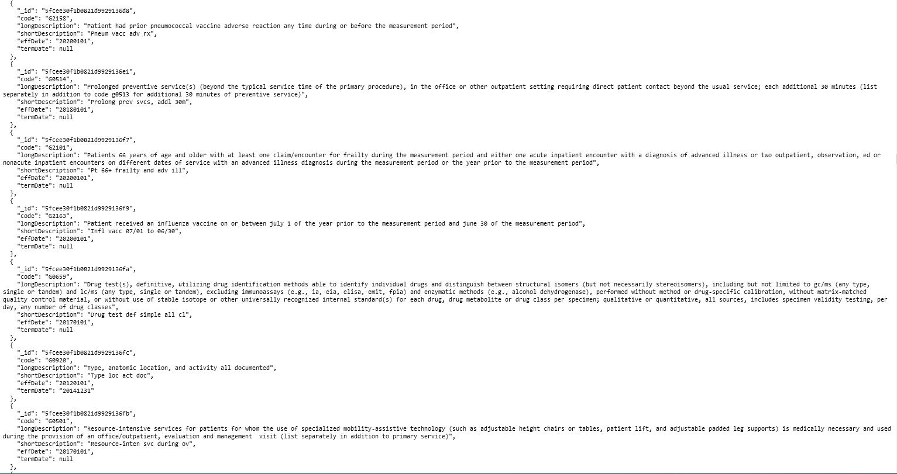

  

Ediapi is a api built around Healthcare Codes. It scrapes CMS and other healthcare websites, pulls and formats their codeset spreadsheets and provides this data via an easy to use api.

* **HCPCS** and **NDC** Codeets currently supported.
* Add Ediapi your software to validate x12 transactions.
* **Hight Customized** to fit different use cases: large file based x12 processing engines
 or small online widgets (like autofill tool).
* Can provide **Code, Description, Dates, and more** for codes or paremeteries specified. You do not have to know the code to search! 

  

| System Parts  | Technology Used |
| ------------- | ------------- |
| Server  | Heroku  |
| Database  | MongoDB  |
| Backend | Javascript | 

## Background
I want to make an easy to use frontend and api for healthcare codesets so
that people can easily make projects or improvie their existing ones. 

⚠️ I do not work on this full time so it will not always be up to date. 
The updates to the codesets are made by either cron jobs (depending on when the
codesets are released) or via manual updates which I do w/ my free time. 

Thanks!
